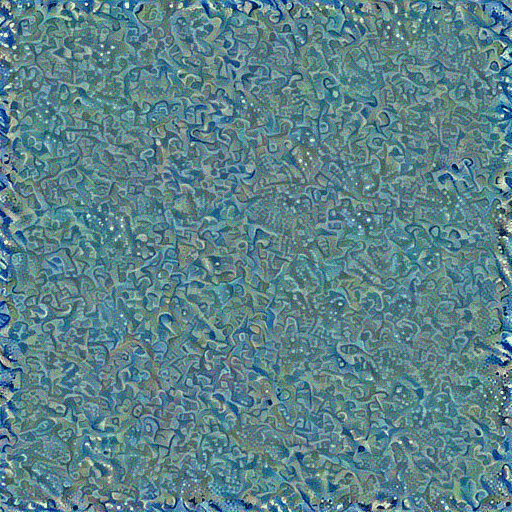
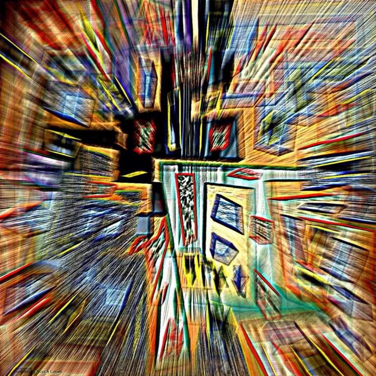
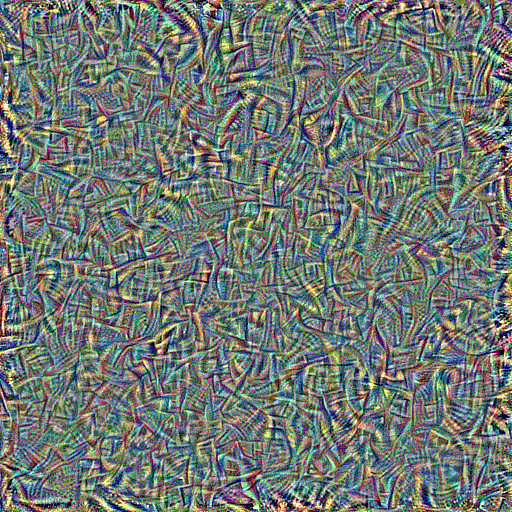
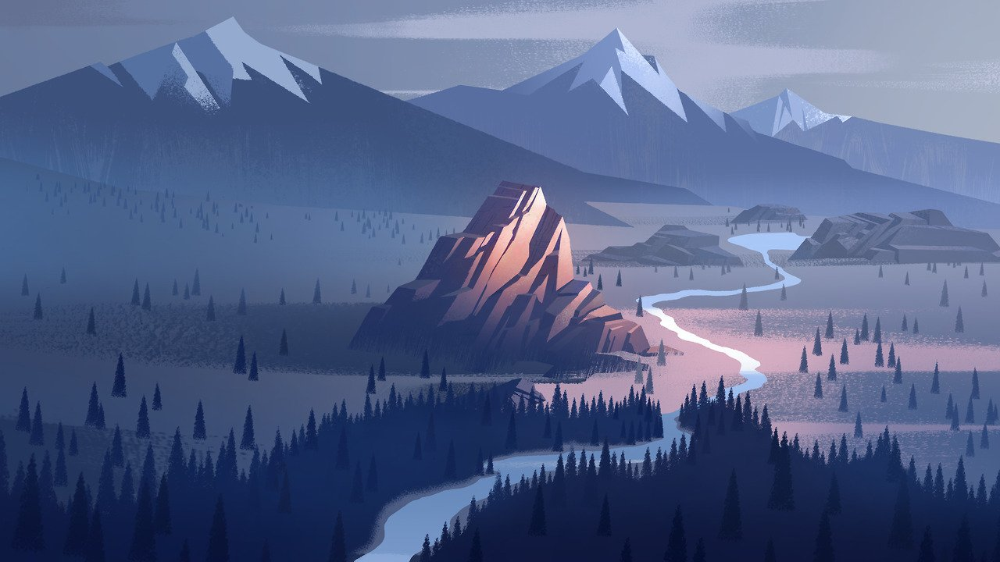
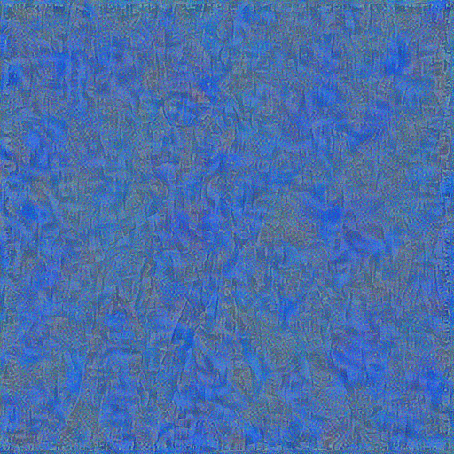
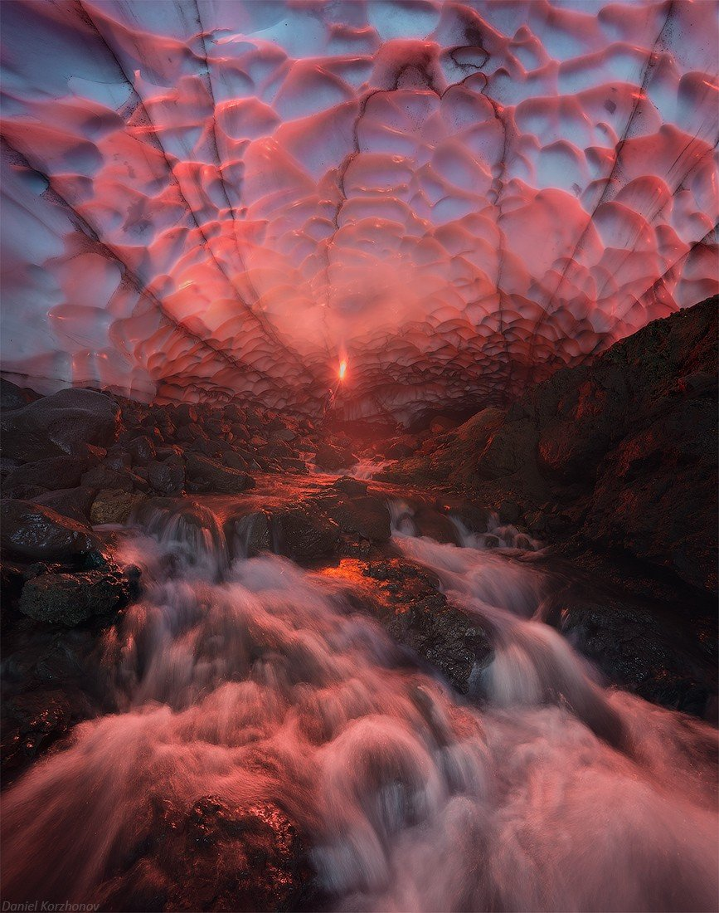
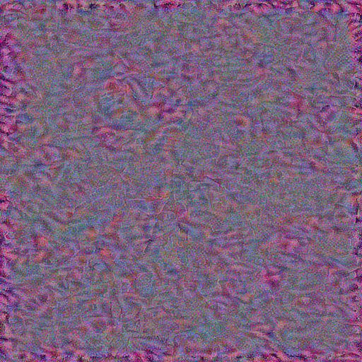

# Neural Style Transfer

Neural Style Transfer is a method that allows us to generate Artistic Images by transfering the style of one image (say a beautiful painting) to another image (say a photo of a person). The resulting output is one image in the style of another. 

This repository contains the code to run the model for Style Transfer on any images of ones choice. The model used is the VGG-19 architecture trained on ImageNet images. 
The input to the network are the **Content/Base Image(C)**, the primary image on which the style is to be transfered and the **Style Image(S)**, the image whose style is to be transfered.

## Requirement
- Python 3.6
- Keras 2.2.2
- Numpy 1.14
- Argparse 1.1
- Scipy 1.1

## Setup
### Step 1:
Clone the repository.
```
git clone https://github.com/Vinohith/Neural_Style_Transfer.git
```

### Step 2:
Run the code
```
cd Neural_Style_Transfer
python neural_style_transfer.py 'content_image_path' 'style_image_path' 'result_prefix'
```
There are a number of optional command-line arguments which can be passed in, including ```--iter```(number of iterations to run), ```--content_weight```(Content weight), ```--style_weight```(Style weight), ```--total_variation_weight```(Total Variation weight). Run the script with the ```--help``` or ```-h``` flag for more information.

## Content Image


## Style Image and Generated Image

    

    

    

    
